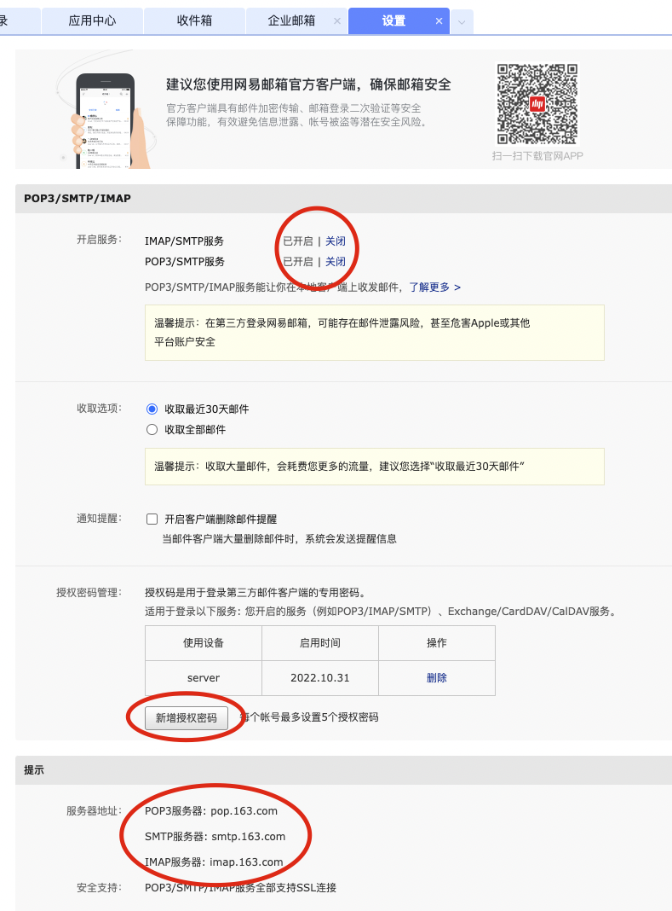

# API-邮件通知

产线运行必不可少-邮件预警

---

## API说明

::: sunday.utils.Email
    :docstring:
    :members: send_mail

::: sunday.utils.getEmailFile
    :docstring:

## 邮箱配置

我们可以自己在服务器搭建邮箱服务，也可以使用第三方邮箱，这里以163邮箱示例

如图，进入邮箱设置:

1. 将开启服务中`IMAP/SMTP服务`和`POP3/SMTP服务`设为已开启
2. 点击`新增授权密码`按钮，根据提示新增一个授权码，这个码是用于认证与登录邮箱的
3. 因为我们是发送邮件因此服务器地址我们选择`smtp.163.com`

配置好后我们就可以安装api说明使用邮件发送功能了！
